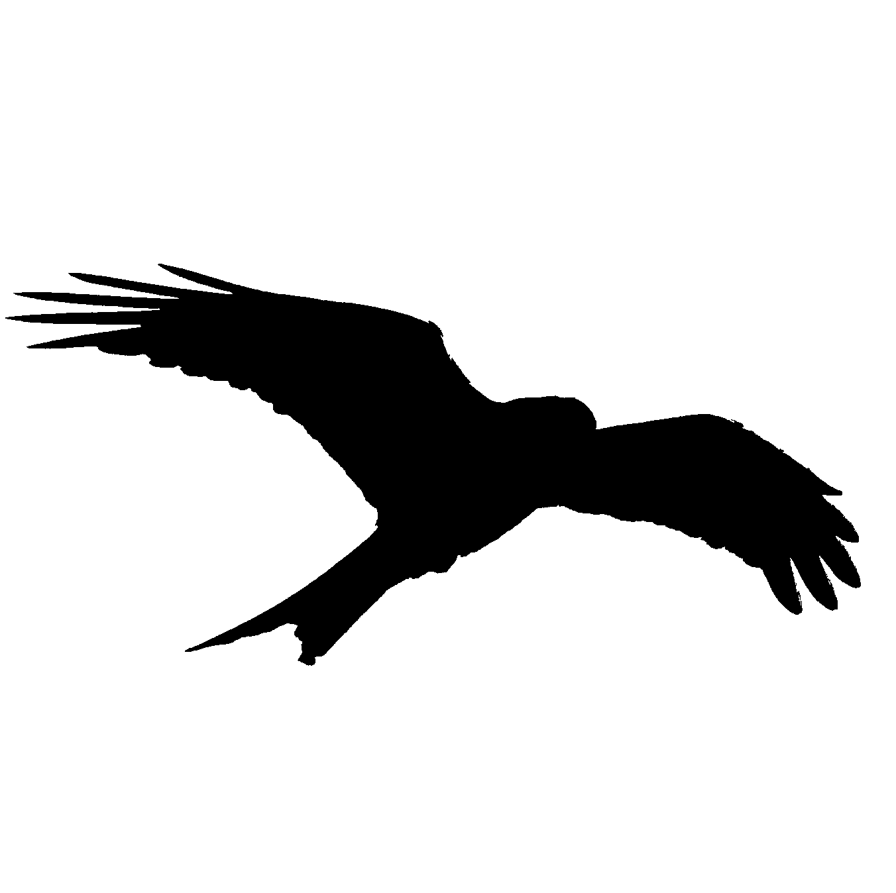

# Wingspan

Wingspan is an experimental text editor.
It uses [druid](https://github.com/xi-editor/druid) for cross platform UI, and 
[rust-analyzer](https://github.com/rust-analyzer/rust-analyzer) for coding assistance.

## Structure

- [`assets`](./assets) contains various images.
- [`textedit`](./textedit) implements the core text editing logic. 
- [`textarea`](./textarea) renders textedit's logic as a druid widget.
- [`wingspan`](./wingspan) creates the UI around the text editor.

## Status

A very basic text editor existes in [`textarea/examples/basic.rs`](textarea/examples/basic.rs). 

## License

The code is licensed under the [Apache-2.0 License](https://www.apache.org/licenses/LICENSE-2.0)

Unless you explicitly state otherwise, any contribution intentionally submitted
for inclusion in the work by you, as defined in the Apache-2.0 license, shall be
dual licensed as above, without any additional terms or conditions.

The contents of the (`assets`)[./assets] folder is licensed under the 
[Creative Commons Attribution-Share Alike 4.0 International](https://creativecommons.org/licenses/by-sa/4.0/?) 
license and is adapted from 
[a photo](https://commons.wikimedia.org/wiki/File:Photo-of-flying-bird-3922221.jpg)
by [Luca Paul](https://www.instagram.com/neverendinghorizon/)